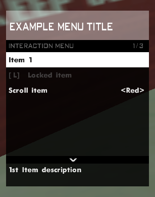

# SA-MP Interaction Menu

*A customizable GTA Online–style interaction menu system for SA-MP.*

Inspired by GTA Online’s interaction menu, it allows developers to add UI functionality to their SA-MP gamemodes.  



- [SA-MP Interaction Menu](#sa-mp-interaction-menu)
  - [✨ Features](#-features)
  - [📦 Installation](#-installation)
  - [📝 Item Formatting](#-item-formatting)
  - [🛠️ Menu Functions](#️-menu-functions)
  - [📖 Documentation](#-documentation)
  - [🤝 Contributing](#-contributing)

## ✨ Features

This library provides a flexible way to create in-game menus with support for:

- 🔒 Locked items
- 🎚️ Scrollable options
- 📝 Support for per-item descriptions and titles  
- 📡 Callbacks: `OnInteractionMenuResponse`, `OnScrollChange`  
- 🎨 Customizable title box color  
- 📜 Submenus

## 📦 Installation

1. Copy `interaction_menu.inc` into your `pawno/include/` folder (or any folder in your include path).
2. In your script, add:  

   ```pawn
   #include <interaction_menu>
   ```
> [!WARNING]
>
> In some cases, by default or when redefining constants to higher values (such as MAX_MENU_ITEMS), the include requires a higher amount of memory, and will require you to increase the heap/stack size accordingly, after including all your libraries:
> 
> ```pawn
> // Fix for " Run time error 3: "Stack/heap collision (insufficient stack size)"
> // Serves as a maximum memory size for variables and arrays (ex: new string[8192])
> #pragma dynamic 4096*2
> #define CGEN_MEMORY (60000) // Fix for CGen space error
> ```

## 📝 Item Formatting

**New lines:** separate items with `\n`  
**Locked items:** wrap the text with `#` → `#Locked Option#`  
**Scrollable items:** put options inside `[]` separated by commas → `[Low, Medium, High]`

## 🛠️ Menu Functions

``ShowPlayerInteractionMenu(playerid, menuid, items[], description[], color)``
> Show a menu to a player.

``AddInteractionMenuItem(playerid, text[])``
> Add an item to the menu.

``AddInteractionMenuItemEx(playerid, text[], description[])``
> Add an item with a custom box color.

``RemoveInteractionMenuItem(playerid, index)``
> Remove an item from the menu.

``OnInteractionMenuResponse(playerid, menuid, itemid)``
> Callback when a player selects an item.

``OnScrollChange(playerid, menuid, itemid, scrollIndex)``
> Callback when a player scrolls through options.

## 📖 Documentation

Full usage, advanced examples, and callbacks are documented here:
👉 [SA-MP Interaction Menu Docs](/docs/WIKI.md)

## 🤝 Contributing

Pull requests are welcome! Feel free to suggest improvements, bug fixes, or new features.
Please read the [contribution guidelines](CONTRIBUTING.md) before submitting.
