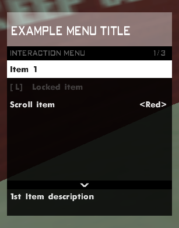

# SA-MP Interaction Menu Documentation

## Table of Contents

- [SA-MP Interaction Menu Documentation](#sa-mp-interaction-menu-documentation)
  - [Table of Contents](#table-of-contents)
  - [Installation](#installation)
  - [Function Reference](#function-reference)
    - [⚙️ Functions](#️-functions)
      - [`ShowPlayerInteractionMenu`](#showplayerinteractionmenu)
        - [Example usage of ShowPlayerInteractionMenu](#example-usage-of-showplayerinteractionmenu)
      - [`AddInteractionMenuItem`](#addinteractionmenuitem)
        - [Example usage of AddInteractionMenuItem](#example-usage-of-addinteractionmenuitem)
      - [`AddInteractionMenuItemEx`](#addinteractionmenuitemex)
        - [Example usage of AddInteractionMenuItemEx](#example-usage-of-addinteractionmenuitemex)
      - [`RemoveInteractionMenuItem`](#removeinteractionmenuitem)
        - [Example usage of RemoveInteractionMenuItem](#example-usage-of-removeinteractionmenuitem)
      - [`GetMenuItemString`](#getmenuitemstring)
        - [Example usage of GetMenuItemString](#example-usage-of-getmenuitemstring)
      - [`GetMenuScrollItemString`](#getmenuscrollitemstring)
        - [Example usage of GetMenuScrollItemString](#example-usage-of-getmenuscrollitemstring)
    - [🔄 CallBacks](#-callbacks)
      - [`OnInteractionMenuResponse`](#oninteractionmenuresponse)
        - [Example usage of OnInteractionMenuResponse](#example-usage-of-oninteractionmenuresponse)
      - [`OnScrollItemChange`](#onscrollitemchange)
        - [Example usage of OnScrollItemChange](#example-usage-of-onscrollitemchange)

---

## Installation

1. Include the script in your SA-MP gamemode:  
   ```#include <interaction_menu>```

## Function Reference

### ⚙️ Functions

#### `ShowPlayerInteractionMenu`

```pawn
ShowPlayerInteractionMenu(playerid, menuid, tdMenuItems, title, description, color)
```

> Shows the player a menu.
>
> - **playerid**: The player to show the menu.
> - **menuid**:  The menu id to later use in `OnInteractionMenuResponse` or `OnScrollChange`.
> - **tdMenuItems**:  The whole items string, separated by `\n`.
> - **title**: The title of the menu. *(optional, defaults to no title)*
> - **description**: The whole description string, separated by `\n`. *(optional, defaults to "No Description")*
> - **color**: The color of the menu header. *(optional, defaults to COLOR_MENU_TITLE_BOX)*

##### Example usage of ShowPlayerInteractionMenu

```pawn
ShowPlayerInteractionMenu(playerid, EXAMPLE_MENU_ID, 
     "Item 1\n#Locked item#\nScroll item[Red, Green, Blue]", "Example_Menu_Title", 
     "1st Item description\nLocked item description\nScroll item description", 
     0xFFFFFF62);
```

 Example image of ShowPlayerInteractionMenu

> [!NOTE]
> Remarks about ShowPlayerInteractionMenu
>
> - Each item is separated by **\n**, the same for descriptions
>
> `Item1\nItem2\nItem3\n`
>
> - To lock items wrap the item in **#**
>
> `#Locked Item#`
>
> - Put items inside **square brackets** to make them scroll items
>
> `Colors[Red, Green, Blue]`

 ---
> [!WARNING]
>
> - The title must have **_** instead of spaces.
>
>`Example_Menu_Title`
>
 ---

#### `AddInteractionMenuItem`

```pawn
AddInteractionMenuItem(playerid, item, desc)
```

> Adds a new item to the player's open menu.
>
> - **playerid**: The player to add a new item.
> - **item**: The item string to add.
> - **desc**: The description for the item *(optional, defaults to "No Description")*

##### Example usage of AddInteractionMenuItem

```pawn
AddInteractionMenuItem(playerid, "New item", "New item description!");
```

 Example image of AddInteractionMenuItem

> [!NOTE]
> Remarks about AddInteractionMenuItem
>
> - Added items can also be locked or scroll items.
>
> - Added items will always be at the bottom of the item list.

 ---

#### `AddInteractionMenuItemEx`

```pawn
AddInteractionMenuItemEx(playerid, item, boxcolor, desc)
```
>
> Adds a new item to the player's open menu with a custom box color.
>
> - **playerid**: The player to add a new item.
> - **item**: The item string to add.
> - **boxcolor**: The custom box color to be used by the item. *(optional, defaults to COLOR_MENU_ITEM_BOX)*
> - **desc**: The description for the item *(optional, defaults to "No Description")*

 ---

##### Example usage of AddInteractionMenuItemEx

```pawn
AddInteractionMenuItemEx(playerid, "New colored item", 0xFF000060, "New item description!");
```

 Example image of AddInteractionMenuItemEx

> [!NOTE]
> Remarks about AddInteractionMenuItemEx
>
> - Added items can also be locked or scroll items.
>
> - Added items will always be at the bottom of the item list.
>
> - The box color of this item will be red

 ---
> [!WARNING]
>
> - When adding a colored item, it's preffered to use a
> semi-transparent color.
>
 ---

#### `RemoveInteractionMenuItem`

```pawn
RemoveInteractionMenuItem(playerid, itemid)
```

> Removes a item from the player's open menu.
>
> - **playerid**: The player to remove the item.
> - **itemid**: The item index in the menu.

##### Example usage of RemoveInteractionMenuItem

```pawn
RemoveInteractionMenuItem(playerid, 3);
```

> [!NOTE]
> Remarks about RemoveInteractionMenuItem
>
> - This will remove the 2nd item in the menu.

---

#### `GetMenuItemString`

```pawn
GetMenuItemString(output, playerid, imenuitem)
```

> Formats a given string with the selected item's text.
>
> - **output**: The given string to format.
> - **playerid**: The player with the menu open.
> - **itemid**: The item index in the menu.

##### Example usage of GetMenuItemString

```pawn
new string[128];
GetMenuItemString(string, playerid, 0);
print(string);
```

> [!NOTE]
> Remarks about GetMenuItemString
>
> - This will format `string` with the 1st item text.
>
> - This would print the 1st item of [ShowPlayerInteractionMenu](#showplayerinteractionmenu), which is "Item 1"

---

#### `GetMenuScrollItemString`  

```pawn
GetMenuScrollItemString(output, playerid, imenuitem, scrollitem)
```

> Formats a given string with the selected scroll item's text.
>
> - **output**: The given string to format.
> - **playerid**: The player with the menu open.
> - **itemid**: The item index in the menu.
> - **scrollitem**: The scroll item index inside **itemid**.

##### Example usage of GetMenuScrollItemString

```pawn
new string[128];
GetMenuItemScrollString(string, playerid, 2, 0);
print(string);
```

> [!NOTE]
> Remarks about GetMenuScrollItemString
>
> - This will format `string` with the 3rd scroll option, inside the 1st menu item.
> - This would print the 1st scroll option inside the 3rd item in [ShowPlayerInteractionMenu](#showplayerinteractionmenu), which is "red"

### 🔄 CallBacks

#### `OnInteractionMenuResponse`

```pawn
OnInteractionMenuResponse(playerid, menuid, bool:response, menuitem)
```

>Called when a player clicks on an item or closes the menu.
>
> - **playerid**: The player who triggered the callback.
> - **menuid**: The id of the player's menu.
> - **response**: Weather or not an item was clicked.
> - **menuitem**: The item index the player clicked. *(-1 if response is `false`)*

##### Example usage of OnInteractionMenuResponse

```pawn
public OnInteractionMenuResponse(playerid, menuid, bool:response, menuitem)
{
    if (response)
    {
        if (menuid == EXAMPLE_MENUID)
        {
            switch (menuitem)
            {
                case 0: SendClientMessage(playerid, 0x00FF00, "You picked the first item!");
                case 1: SendClientMessage(playerid, 0x00FF00, "You picked the second item!");
                case 2: SendClientMessage(playerid, 0x00FF00, "You picked the third item!");
            }
        }
    }
    else return SendClientMessage(playerid, 0xFF0000, "You closed the menu!");

    return 1;
}
```


> [!NOTE]
> Remarks about `OnInteractionMenuResponse`
>
> - This checks if the player clicked an item inside menuid `EXAMPLE_MENUID`` and sends a message accordinly.
> - Also sends a message if the player closes the menu

 ---

#### `OnScrollItemChange`

```pawn
OnScrollItemChange(playerid, menuid, menuitem, scrollitem)
```

>Called when the player changes a scroll options inside a menu.
>
> - **playerid**: The player who triggered the callback.
> - **menuid**: The id of the player's menu.
> - **menuitem**: The item index the player scrolled in.
> - **scrollitem**: The scroll option the player scrolled to, inside `menuitem`

##### Example usage of OnScrollItemChange

```pawn
public OnScrollItemChange(playerid, menuid, menuitem, scrollitem)
{
    if (menuid == EXAMPLE_MENU_ID)
    {
        if (menuitem == 2)
        {
            switch (scrollitem)
            {
                case 0: SendClientMessage(playerid, 0xFF0000FF, "You picked the red color!");
                case 1: SendClientMessage(playerid, 0x00FF00FF, "You picked the green color!");
                case 2: SendClientMessage(playerid, 0x00B7FFFF, "You picked the blue color!");
            }
        }
    }

    return 1;
}
```


> [!NOTE]
> Remarks about OnScrollItemChange
>
> - This checks if the player scrolled on the 3rd item of EXAMPLE_MENU_ID menu.

 ---
